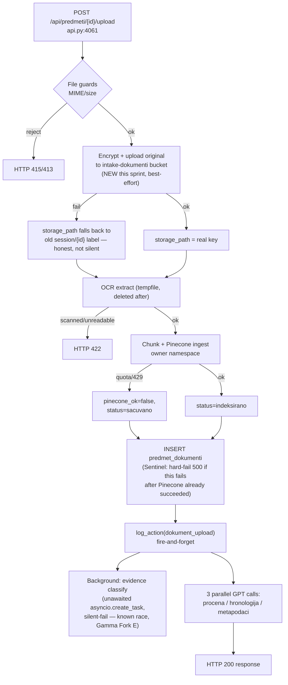
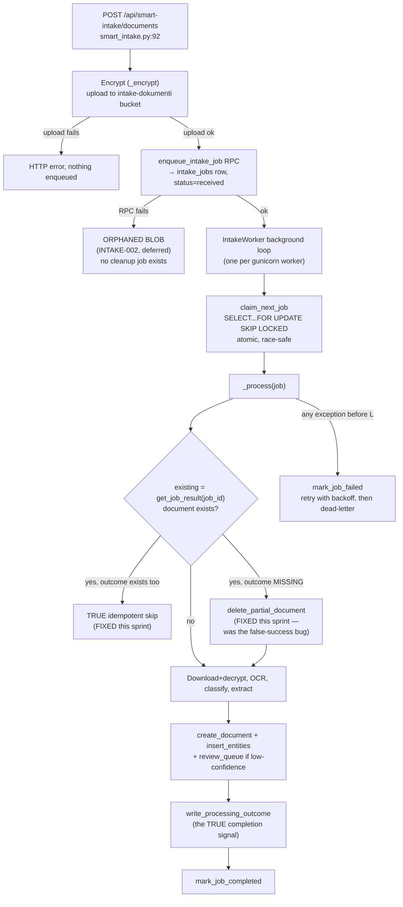
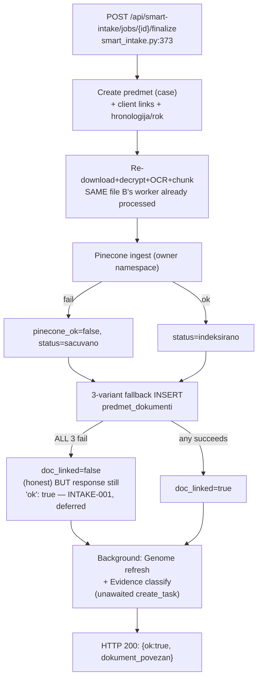
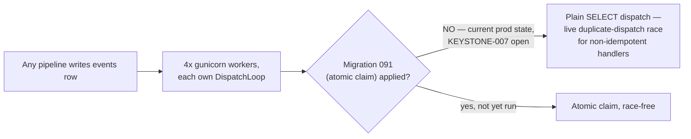

# Intake Flow Diagram — Program Intake Sprint 001 (2026-08-04)

Full narrative and citations: `INTAKE_ARCHITECTURE_REPORT.md`. This is the canonical map of all three live
upload pipelines as of this sprint's fixes.

## Pipeline A — attach document to existing case (synchronous)

## Pipeline B — document-first intake, durable queue

## Pipeline C — finalize (second synchronous pass over B's already-processed file)

## Cross-cutting: Event Bus durable outbox (underneath all three)

