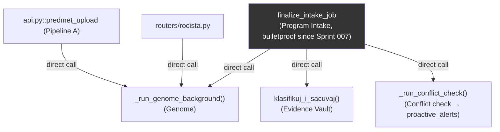
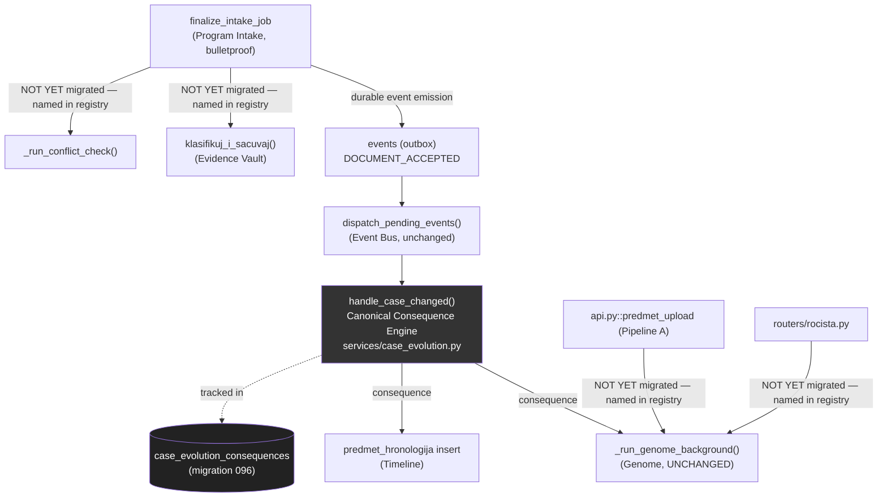

# Updated Architecture Diagram — Program Delta, Sprint 001 (2026-08-05)

## Before this sprint

Three independent call sites each decide, for themselves, "what happens after a case changes" — no shared
mechanism, no unified idempotency story, no unified audit trail for "a consequence of a case change happened."

## After this sprint

## What changed, structurally

- **One canonical dispatcher** (`handle_case_changed`) now owns "what follows `DOCUMENT_ACCEPTED`" — Pipeline
  C's own Genome-refresh trigger no longer decides for itself; it emits an event and the dispatcher decides.
- **One new durable table** (`case_evolution_consequences`) makes every consequence's completion state
  independently trackable and retry-safe, without inventing a parallel event log — it hangs directly off the
  already-durable `events` table (migration 073).
- **Genome, Timeline, Evidence Vault, and the conflict-check mechanism are themselves completely untouched** —
  per the mission's own explicit prohibition. The consequence engine calls them exactly as they were called
  before, just from one canonical place instead of an ad-hoc inline call.

## What deliberately still looks like "before," named honestly

Pipeline A's own Genome trigger, `routers/rocista.py`'s own Genome trigger, and Pipeline C's own Evidence
Vault/conflict-check calls are UNCHANGED this sprint — real, existing "scattered decision" call sites,
documented in `CASE_EVOLUTION_REGISTRY.md`'s own Task 3 findings table, not migrated under this sprint's hard
2-agent budget. Migrating them is mechanical (same registry, same dispatcher, a different emission call site)
and is the natural next Delta sprint's own bounded scope.
