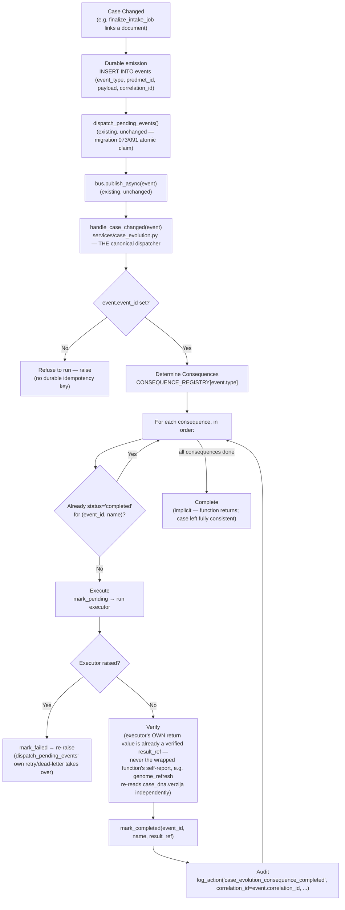
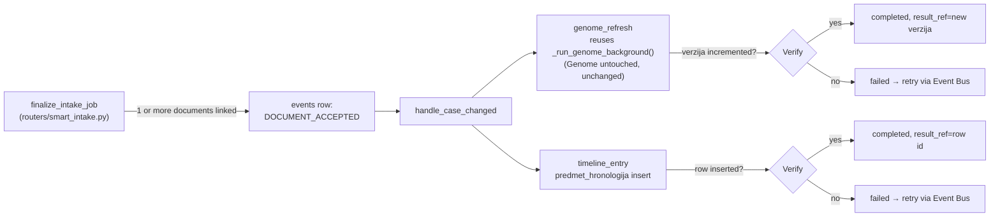
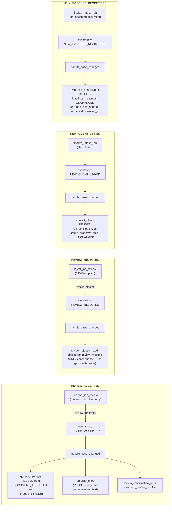
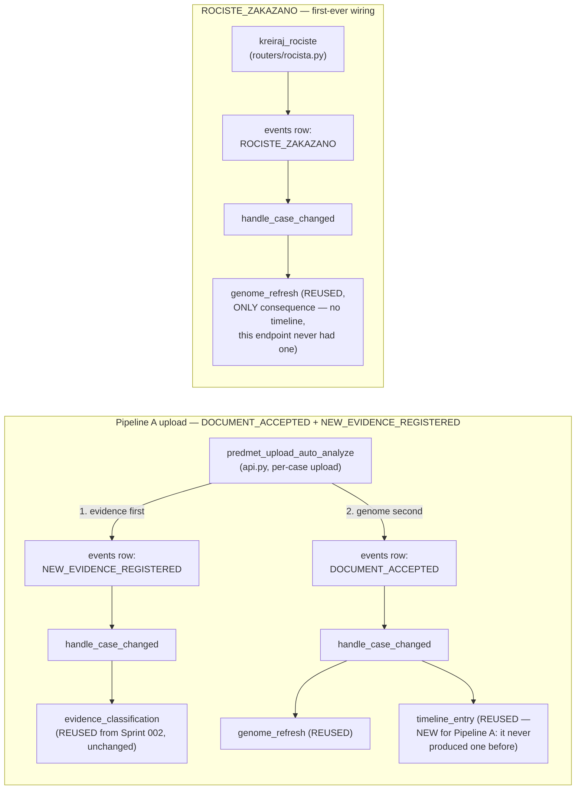

# Event Flow Diagram — Program Delta (living document, updated each sprint)

Sprint 001 (2026-08-05) established the canonical flow below for `DOCUMENT_ACCEPTED`. Sprint 002 (2026-08-05,
"Canonical Event Migration I") reused the EXACT SAME flow for 4 more event types. Sprint 003 (2026-08-05,
"Canonical Event Migration II — Complete Event Convergence") migrates the LAST 2 direct-orchestration call
sites (Pipeline A, `routers/rocista.py`) and wires the LAST event with a genuine consequence need
(`ROCISTE_ZAKAZANO`) — no diagram change needed for the mechanism itself here either; only new concrete flows
(below) and a "before/after, full picture" diagram showing zero remaining bypass paths.

## The canonical flow, for any event with a populated `CONSEQUENCE_REGISTRY` entry

## DOCUMENT_ACCEPTED, concretely (this sprint's one wired event)

## The 4 events wired in Sprint 002, concretely

## The 2 events wired in Sprint 003, concretely

## What did NOT change

The durable outbox (`events` table), the atomic claim (`claim_pending_events`, migration 091), the
retry/dead-letter loop (`dispatch_pending_events`, `MAX_DISPATCH_ATTEMPTS=5`), and correlation_id propagation
(`shared/ai_provenance.py`) are all **reused exactly as they existed before Sprint 001** — Program Delta adds
exactly one new layer (`services/case_evolution.py` + `case_evolution_consequences`, migration 096) on top of
proven, already-hardened infrastructure. Sprint 002 adds one small refactor on top of that same layer —
`services/event_bus.py::emit_durable()` — factoring Sprint 001's own single emission idiom into one shared
function instead of copying its try/except/fallback boilerplate at each of the 4 new call sites (and
retrofitting `DOCUMENT_ACCEPTED`'s own Sprint-001 emission site to use it too) — still no new retry/dead-letter
machinery, just one fewer copy of the same code. Sprint 003 uses `emit_durable()` at 2 more call sites
(`api.py`, `routers/rocista.py`) and wires 2 EXISTING consequence executors (`genome_refresh`,
`evidence_classification`) to a 6th event type (`ROCISTE_ZAKAZANO`) — zero new consequence logic, zero new
Genome/Timeline/Evidence capability, zero new retry/audit/provenance machinery. Every reusable piece built in
Sprints 001-002 was reused, not rebuilt, a 3rd consecutive sprint.
