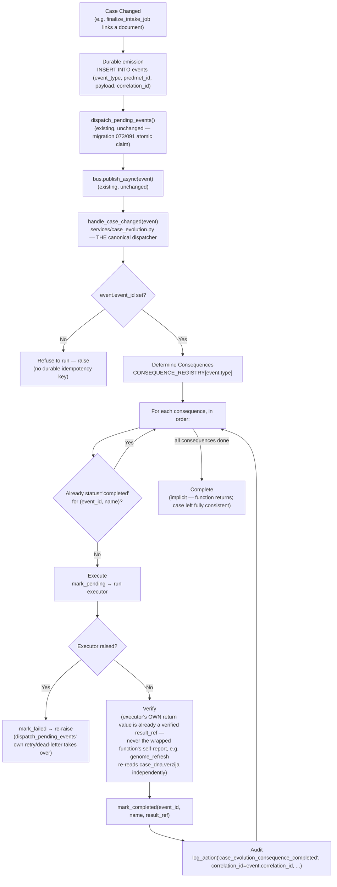
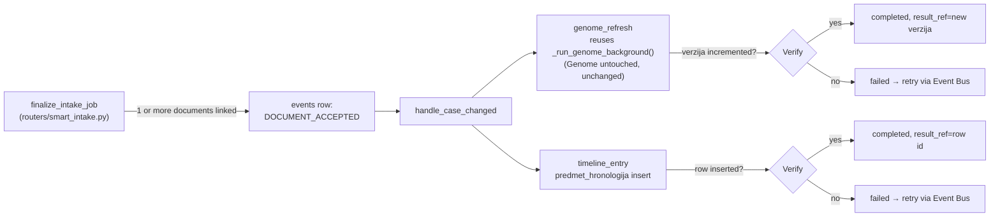

# Event Flow Diagram — Program Delta, Sprint 001 (2026-08-05)

## The canonical flow, for any event with a populated `CONSEQUENCE_REGISTRY` entry

## DOCUMENT_ACCEPTED, concretely (this sprint's one wired event)

## What did NOT change

The durable outbox (`events` table), the atomic claim (`claim_pending_events`, migration 091), the
retry/dead-letter loop (`dispatch_pending_events`, `MAX_DISPATCH_ATTEMPTS=5`), and correlation_id propagation
(`shared/ai_provenance.py`) are all **reused exactly as they existed before this sprint** — Program Delta adds
exactly one new layer (`services/case_evolution.py` + `case_evolution_consequences`, migration 096) on top of
proven, already-hardened infrastructure, per this sprint's own "hard token budget" discipline (build the
canonical orchestration mechanism, not a new event system).
